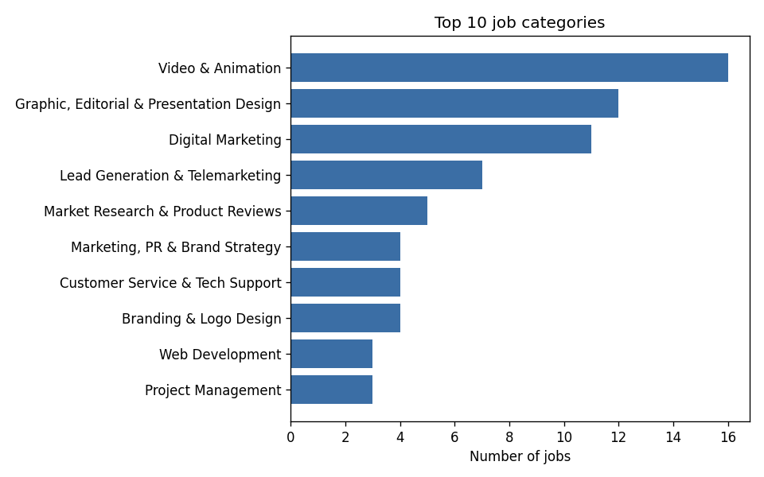
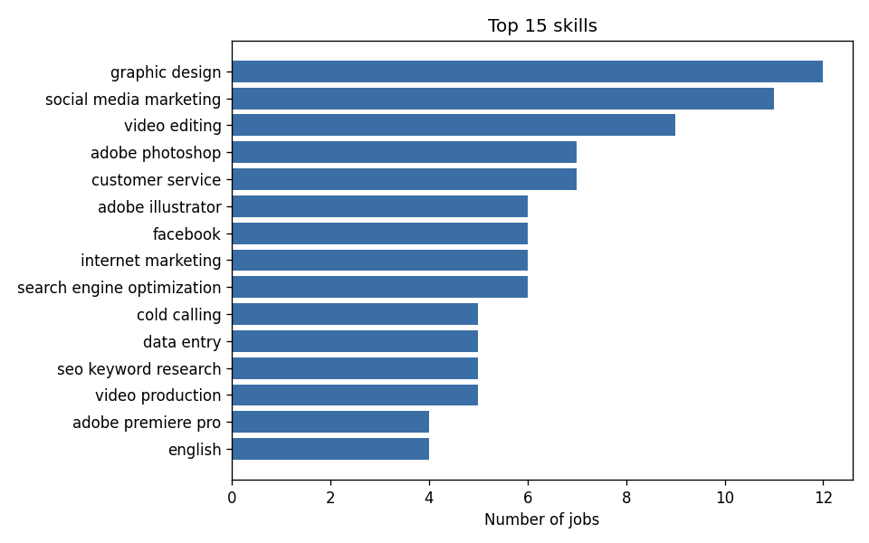
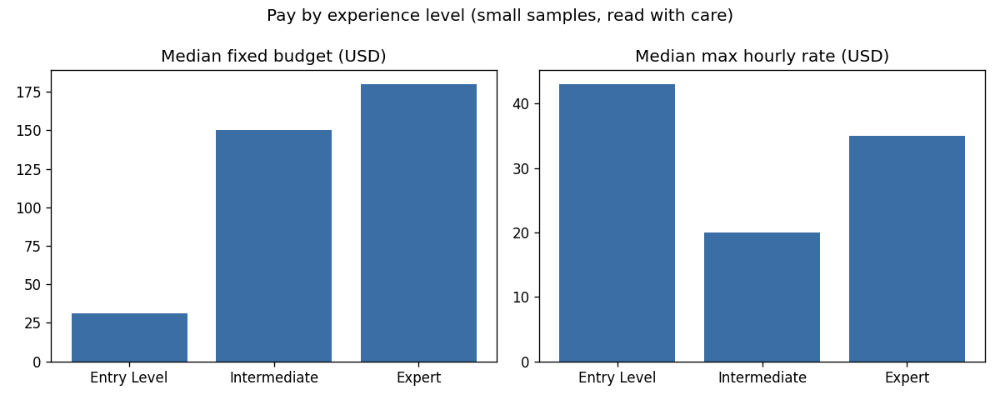
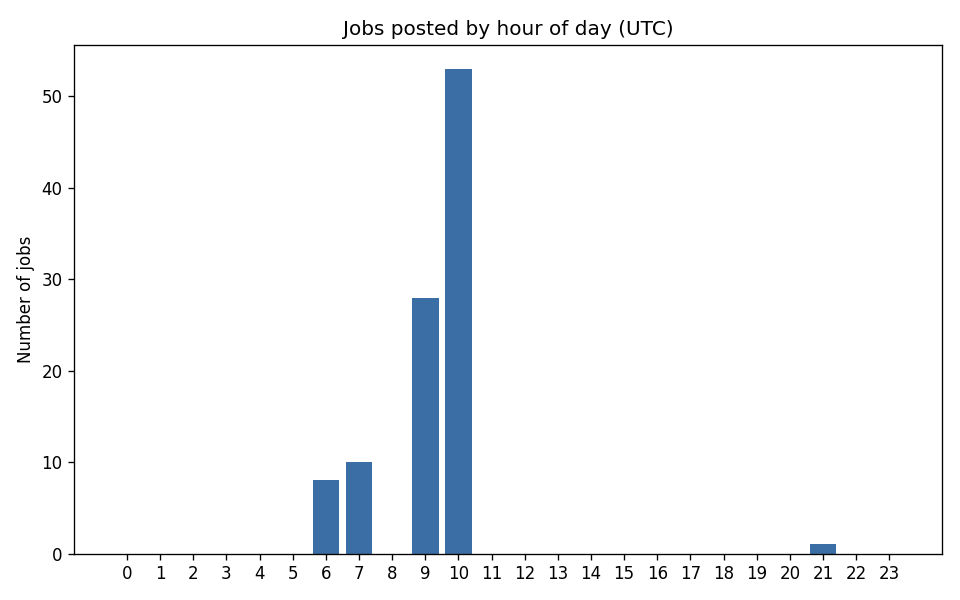

# Upwork Jobs Assignment

This project cleans a raw CSV of Upwork job posts, stores it in a SQLite database, and analyses it with charts and a few insights. It also includes a small scraper that saves sample jobs from RemoteOK.

## Files

- `etl.py`: cleans the raw CSV and builds the clean CSVs and the database
- `analysis.py`: creates the charts and insights from the database
- `scraper.py`: saves a sample of jobs from RemoteOK
- `data/raw`: the input CSV and the scraper's sample output
- `data/clean`: cleaned CSVs and `jobs.db`
- `output`: charts and `insights.txt`

## How to run

Requires Python 3.9 or newer. Put `upwork_raw_jobs.csv` in `data/raw` first.

```
pip install -r requirements.txt
python etl.py
python analysis.py
python scraper.py
```

`etl.py` must run before `analysis.py`, since the analysis reads from the database. `scraper.py` is independent.

## The data

The file has 100 jobs and 21 columns. Half are fixed-price and half are hourly. The jobs come from 40 countries and 32 categories. Most are Intermediate level (66), followed by Expert (20) and Entry Level (14). Nearly all of them (99) were posted on the same day, 2026-08-23.

A few columns, such as `client_info` and `raw_data`, contain JSON text. I used those to get the client payment status and the skills.

## Cleaning

- No duplicates were found (checked by id and by URL), but the check stays in for larger files.
- The `skills` column is empty in every row. The real skills are inside `raw_data`, so I extracted them from there. This gave 344 unique skills, and every job has at least one.
- 17 rows used 3-letter country codes (like `USA`). I replaced them with full country names.
- Titles and descriptions had curly quotes, non-breaking spaces and line breaks. I replaced them and collapsed the whitespace.
- A fixed budget is only kept for fixed-price jobs and only if it is above zero.
- 5 fixed budgets are far above the rest (IQR rule). I flagged them in a `budget_outlier` column instead of removing them.
- Dates were converted to UTC and all of them parsed correctly. No hourly rate had its minimum above its maximum.
- Missing values are left empty. They are: fixed budget (50, the hourly jobs), hourly rates (69, the 50 fixed jobs plus 19 hourly jobs with no range), proposals (21), client feedback score (11) and client total spent (42).

## Pipeline and database

`etl.py` has three steps: extract reads the CSV, transform does the cleaning, and load writes the output. The database is rebuilt on every run, so running it twice does not create duplicates.

The cleaned data is stored in three tables. Skills are kept separate because one job can have many skills and one skill can belong to many jobs.

- `jobs`: one row per job (title, description, category, budget, rates, experience level, country, proposals, client details, posted date)
- `skills`: one row per unique skill
- `job_skills`: links each job to its skills

## Insights

1. Video & Animation is the largest category with 16 of 100 jobs. The top three categories together cover 39 jobs.
2. The most requested skills are graphic design (12), social media marketing (11) and video editing (9). Demand is mostly design, video and marketing rather than coding.
3. Fixed budgets are very uneven. The median is $100, the mean is $585 and the maximum is $11,000, so the median is the better figure.
4. 19 of the 50 hourly jobs (38%) show no rate range. Where there is one, the median maximum rate is $25 per hour.
5. The median job has 4 proposals, and 61% have 5 or fewer.
6. 21% of clients have no verified payment method.






## Scraper

`scraper.py` saves up to 50 current jobs from [RemoteOK](https://remoteok.com) to `data/raw/remoteok_sample.csv`. I did not scrape Upwork because its terms do not allow it and it blocks bots. RemoteOK has a public API and asks for a link back, which is included here. The scraper is separate from the ETL and its output is not used by it.

## Limitations

The data covers about one day, so posting trends over time cannot be measured. The hour-of-day chart is the closest alternative. With only 100 jobs, the pay by experience chart should be read as a rough guide.